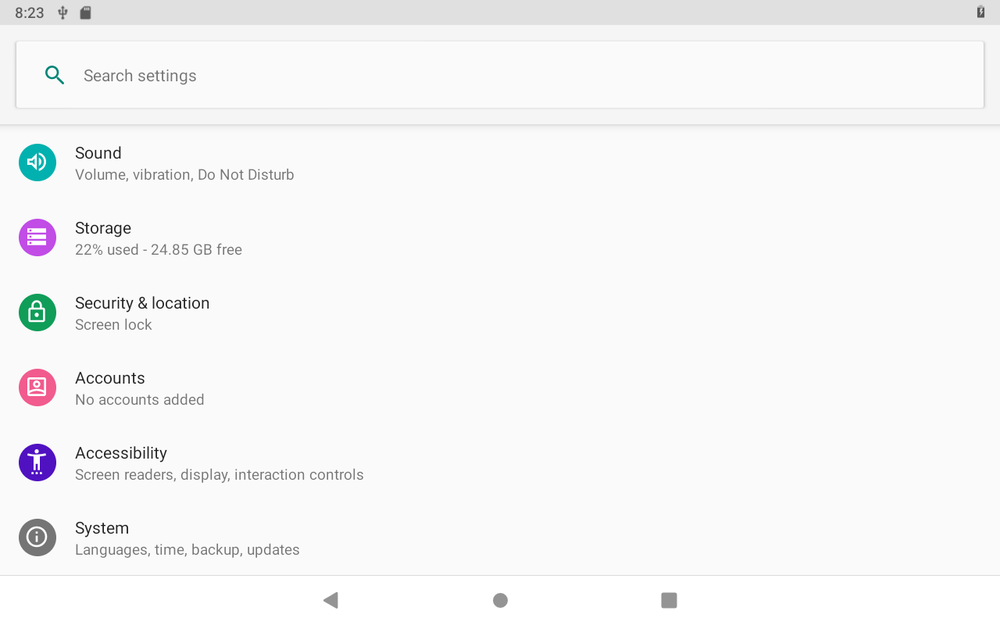
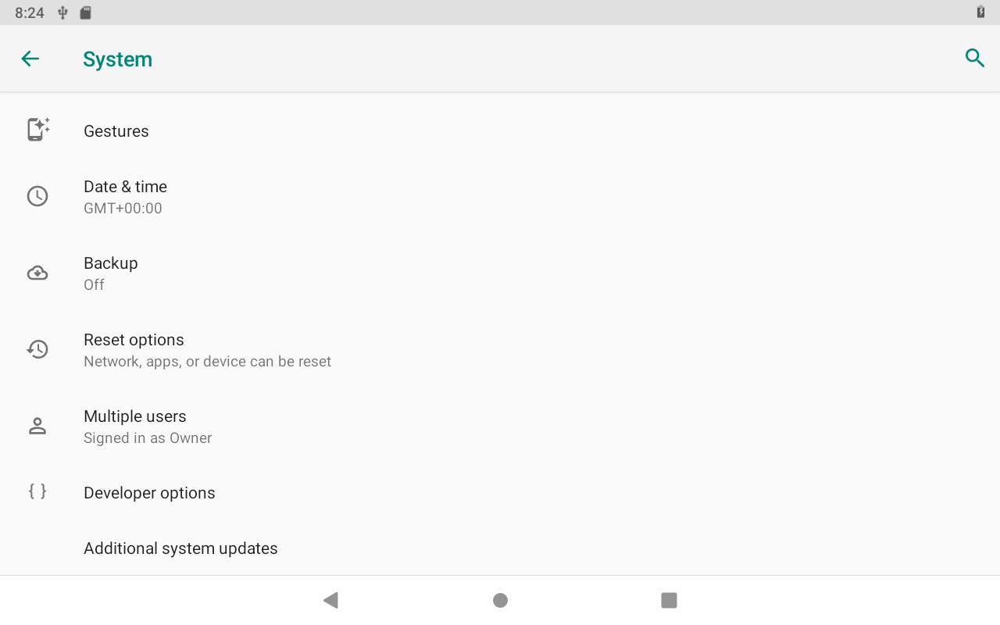
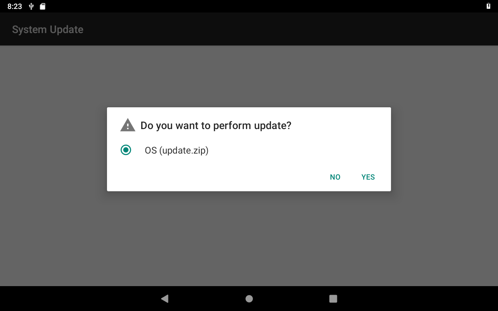
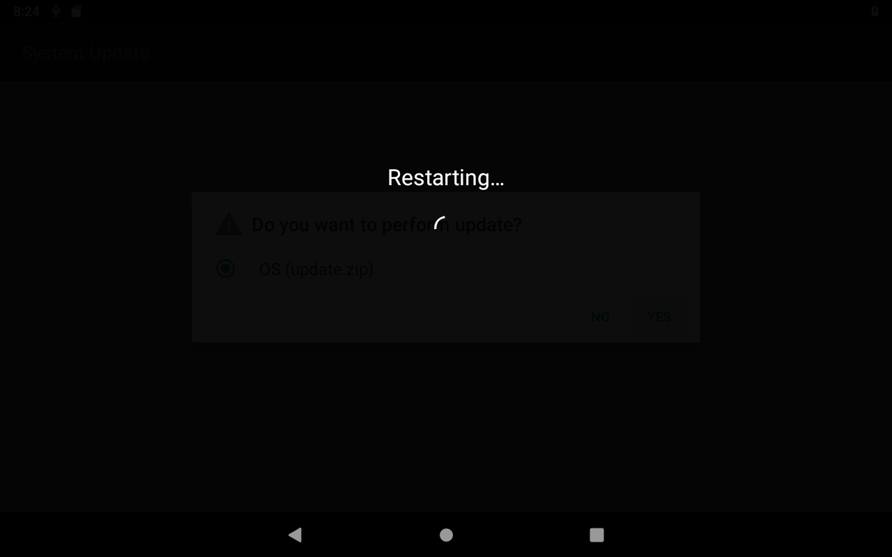

### Prepare OTA package
+ make ota package :

  `source build/envsetup.sh ; lunch aosp_arm64-eng ; make -j8 otapackage`

	+ will generate OTA update package *.zip at out folder : `out/target/product/aosp_arm64/aosp_arm64-ota-eng.tingsung.zip`

	+ rename it to update.zip and put it into the usb removeable disk

<br>

### Prepare Apk to show UI and trigger OTA update
+ create activity as the one Settings entry

<div align="center">




</div>

<br>

```
diff --git a/device.mk b/imx8q/ms5765/device.mk
index ed39733b..1f3cd41c 100644
--- a/device.mk
+++ b/device.mk
@@ -294,3 +294,6 @@ PRODUCT_PROPERTY_OVERRIDES += ro.frp.pst=/dev/block/by-name/presistdata
 PRODUCT_COMPATIBLE_PROPERTY_OVERRIDE := true

 BOARD_VNDK_VERSION := current
+
+PRODUCT_PACKAGES += \
+    OtaUI
\ No newline at end of file
diff --git a/packages/apps/Settings/res/values/config.xml b/packages/apps/Settings/res/values/config.xml
index 5380d2d0..e23a0295 100644
--- a/packages/apps/Settings/res/values/config.xml
+++ b/packages/apps/Settings/res/values/config.xml
@@ -15,7 +15,7 @@
 -->

 <resources xmlns:xliff="urn:oasis:names:tc:xliff:document:1.2">
-    <string name="additional_system_update" translatable="false">com.android.ota</string>
-    <string name="additional_system_update_menu" translatable="false">com.android.ota.OtaAppActivity</string>
+    <string name="additional_system_update" translatable="false">com.ui.android.ota</string>
+    <string name="additional_system_update_menu" translatable="false">com.ui.android.ota.SystemUpdateActivity</string>

 </resources>
--
```

<br>

+ call `RecoverySystem.installPackage(this, recoveryFile);` to execute recovery "setup-bcb" service and reboot to recovery mode.
```
xref: /frameworks/base/services/core/java/com/android/server/RecoverySystemService.java

258        private boolean setupOrClearBcb(boolean isSetup, String command) {
259            mContext.enforceCallingOrSelfPermission(android.Manifest.permission.RECOVERY, null);
260
261            final boolean available = checkAndWaitForUncryptService();
262            if (!available) {
263                Slog.e(TAG, "uncrypt service is unavailable.");
264                return false;
265            }
266
267            if (isSetup) {
268                SystemProperties.set("ctl.start", "setup-bcb");
269            } else {
270                SystemProperties.set("ctl.start", "clear-bcb");
271            }
272
273            // Connect to the uncrypt service socket.
274            LocalSocket socket = connectService();
275            if (socket == null) {
276                Slog.e(TAG, "Failed to connect to uncrypt socket");
277                return false;
278            }
279
280            DataInputStream dis = null;
281            DataOutputStream dos = null;
282            try {
283                dis = new DataInputStream(socket.getInputStream());
284                dos = new DataOutputStream(socket.getOutputStream());
285
286                // Send the BCB commands if it's to setup BCB.
287                if (isSetup) {
288                    byte[] cmdUtf8 = command.getBytes("UTF-8");
289                    dos.writeInt(cmdUtf8.length);
290                    dos.write(cmdUtf8, 0, cmdUtf8.length);
291                    dos.flush();
292                }
293
294                // Read the status from the socket.
295                int status = dis.readInt();
296
297                // Ack receipt of the status code. uncrypt waits for the ack so
298                // the socket won't be destroyed before we receive the code.
299                dos.writeInt(0);
300
301                if (status == 100) {
302                    Slog.i(TAG, "uncrypt " + (isSetup ? "setup" : "clear") +
303                            " bcb successfully finished.");
304                } else {
305                    // Error in /system/bin/uncrypt.
306                    Slog.e(TAG, "uncrypt failed with status: " + status);
307                    return false;
308                }
309            } catch (IOException e) {
310                Slog.e(TAG, "IOException when communicating with uncrypt:", e);
311                return false;
312            } finally {
313                IoUtils.closeQuietly(dis);
314                IoUtils.closeQuietly(dos);
315                IoUtils.closeQuietly(socket);
316            }
317
318            return true;
319        }
```

<br>
<br>

### Mount usb disk in the recovery mode

mount usb removeable disk, generally its node is /dev/block/sda1 to the specific mount point /udisk.

  [0001-mount-usb-removeable-disk.patch](./aosp/bootable/recovery/0001-mount-usb-removeable-disk.patch)

  [0002-disable-selinux-before-execute-install_pacakge.patch](./aosp/bootable/recovery/0002-disable-selinux-before-execute-install_pacakge.patch)

!! issue: in the recovery mode, need to close selinux, and thus it can mount /dev/block/sda1 to /udisk,
otherwise fails. However, they are no avc denied logs to show which rule is violated!


<br>

### Print log to UART console in the recovery mode

```
#ifndef _LANDSEM_RECOVERY_LOG_H
#define _LANDSEM_RECOVERY_LOG_H

#include <sys/types.h>
#include <sys/stat.h>
#include <fcntl.h>
#include <stdarg.h>

#define USE_UART_DEBUG 1
#if USE_UART_DEBUG
   #define DEBUG_UART_PORT  /* "/dev/ttyS0" */ /* "/dev/console" */  "/dev/ttyLP0"
#endif

static int consolelog(const char *fmt, ...) {
   int ret;
   va_list ap;
   va_start(ap, fmt);
#if USE_UART_DEBUG
   FILE *tty_out = fopen(DEBUG_UART_PORT, "w+");
   if(NULL != tty_out)	{
	  ret = vfprintf(tty_out, fmt, ap);
	  fclose(tty_out);
	  tty_out = NULL;
   }
   else {
	   ret = vfprintf(stdout, fmt, ap);
   }
#else
   ret = vfprintf(stdout, fmt, ap);
#endif
   va_end(ap);
   return ret;
}

#endif // _LANDSEM_RECOVERY_LOG_H
```

> ref: [【recovery】android使用串口打印recovery调试日志 by yingxian_Fei](https://blog.csdn.net/smilefyx/article/details/78836476)

<br>

### Notes
* disable selinux : append [BOARD_KERNEL_CMDLINE += androidboot.selinux=permissive](http://androidxref.com/9.0.0_r3/search?q=%22androidboot.selinux%22&defs=&refs=&path=&hist=&project=art&project=bionic&project=bootable&project=build&project=compatibility&project=cts&project=dalvik&project=developers&project=development&project=device&project=external&project=frameworks&project=hardware&project=kernel&project=libcore&project=libnativehelper&project=packages&project=pdk&project=platform_testing&project=prebuilts&project=sdk&project=system&project=test&project=toolchain&project=tools) to kernel commands.
```
@ BoardConfig.mk
BOARD_KERNEL_CMDLINE += androidboot.selinux=permissive
```


<br>
<br>

> Base on android 9
